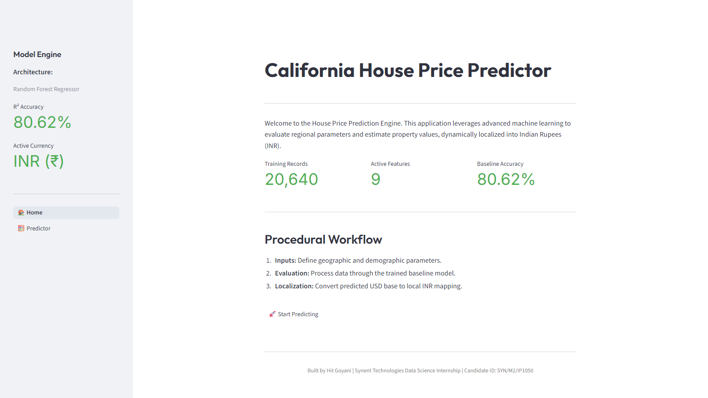

# Task 4 - CSV to Dashboard

**Synent Technologies Data Science Internship | SYN/M2/IP1050**

---

## Problem Statement

Create an interactive dashboard that takes a CSV dataset and dynamically displays exploratory data analysis (EDA) insights. The application must support file uploads and dynamically generate charts based on the dataset's features.

---

## Features

- **Dynamic File Upload:** Users can upload any `.csv` dataset.
- **Dataset Overview:** Automatically calculates dataset dimensions, missing values, and infers data types.
- **Descriptive Statistics:** Generates comprehensive summary statistics across all columns.
- **Visual Exploration Studio:** Dynamically populates axes selections based on column data types, supporting:
  - Scatter Plots
  - Histograms
  - Bar Charts
  - Box Plots
  - Correlation Heatmaps
- **Sample Datasets:** Includes built-in support for the Titanic and Iris datasets for quick testing.

---

## Use Cases

- Rapid exploratory data analysis
- Teaching and demonstrations
- Dataset profiling
- Quick visualization without coding

---

## Technical Stack

- **Frontend & App Logic:** Streamlit
- **Data Manipulation:** Pandas
- **Visualization:** Plotly Express
- **Language:** Python 3.x

---

## Setup & Execution

### 1. Install Dependencies
```bash
pip install -r requirements.txt
```

### 2. Launch the Application
```bash
streamlit run app.py
```

---

## Visual Demonstration

### Empty State


### Loaded Dashboard
*The dynamic dashboard loaded with the Titanic Sample Dataset, displaying a Scatter Plot of Age vs Fare colored by Survival status.*


---
*Built by Hit Goyani*  
*Synent Technologies Data Science Internship*  
*Candidate ID: SYN/M2/IP1050*
